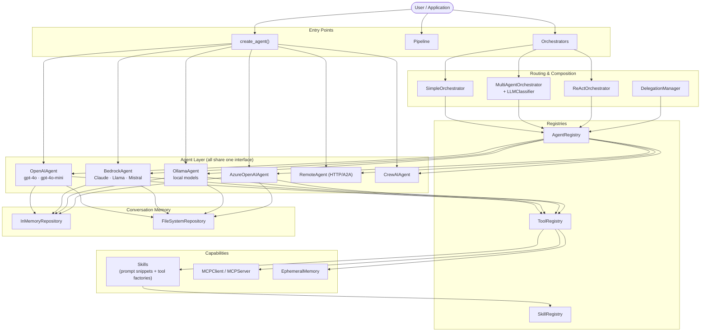

# MOYA — Meta Orchestration framework for Your Agents

MOYA is a lightweight, model-agnostic Python framework for building multi-agent AI systems. It provides a unified API across LLM providers, composable pipelines, a skill/tool system, conversation memory, and first-class MCP support — all designed to be readable and easy to extend.

Based on the research paper **"Engineering LLM Powered Multi-agent Framework for Autonomous CloudOps"** — preprint at [arXiv:2501.08243](https://arxiv.org/abs/2501.08243).

---

## Architecture Overview



---

## Features

**Model-Agnostic Agents**
- OpenAI (gpt-4o, gpt-4o-mini, …), AWS Bedrock (Claude, Llama, Mistral, Titan), Ollama (local), Azure OpenAI, CrewAI, and HTTP remote agents — all behind the same `handle_message()` interface.
- Genuine token streaming via `handle_message_stream()` on every provider.

**Tool System**
- Define tools as plain Python functions — MOYA auto-generates schemas from type hints and docstrings.
- Provider-agnostic: the `ToolRegistry` formats schemas for OpenAI, Bedrock Converse, and Ollama automatically.
- MCP (Model Context Protocol) client and server included.

**Skills**
- Reusable bundles of a prompt snippet + tool factory.
- Attach skills to agents at construction time; snippets are appended to `system_prompt` and tools are registered automatically.
- `SkillRegistry` supports lookup by name, tag, or name fragment.

**Conversation Memory**
- `InMemoryRepository` (default) and `FileSystemRepository` (durable JSON).
- Instance-based `EphemeralMemory` keeps each agent's memory isolated.
- Pluggable — implement `Repository` to use any store.

**Pipelines & Flows**
- Declarative `Pipeline` with five step types: `AgentStep`, `FunctionStep`, `ParallelStep`, `BranchStep`, `LoopStep`.
- Steps share state via `FlowContext` (output + metadata dict).
- Pipelines are composable — nest them inside `FunctionStep` for sub-pipelines.

**Multi-Agent Orchestration**
- `SimpleOrchestrator` — route by agent name.
- `MultiAgentOrchestrator` — LLM-based classifier picks the right agent.
- `ReActOrchestrator` — Thought → Action → Observation loop.
- `DelegationManager` — programmatic sub-agent delegation with depth limiting and parallel dispatch.

**Agent Registry**
- Runtime discovery: find agents by name, type, description, skill, or tag.
- `AgentInfo` metadata snapshots without exposing the live agent object.

---

## Installation

```bash
# Core framework (no LLM provider)
pip install moya-ai

# With a specific provider
pip install "moya-ai[openai]"
pip install "moya-ai[awsbedrock]"
pip install "moya-ai[ollama]"
pip install "moya-ai[azure]"
pip install "moya-ai[crewai]"

# Everything
pip install "moya-ai[all]"
```

Requires Python 3.11+.

---

## Quick Start

### One agent, one call

```python
from moya import create_agent

agent = create_agent(
    "openai",
    name="assistant",
    description="General-purpose assistant",
    api_key="sk-...",   # or set OPENAI_API_KEY
)

response = agent.handle_message("Explain MOYA in one sentence.")
print(response)
```

### Agent with tools

```python
from moya import create_agent, Tool, ToolRegistry

def get_weather(city: str) -> str:
    """Return current weather for a city.

    Parameters:
    - city: The city name.
    """
    return f"Sunny, 22 °C in {city}"

registry = ToolRegistry()
registry.register_tool(Tool(name="get_weather", function=get_weather))

agent = create_agent(
    "openai",
    name="weather_bot",
    description="Answers weather questions",
    tool_registry=registry,
)

print(agent.handle_message("What's the weather in Paris?"))
```

### Skills — reusable prompt + tools

```python
from moya import create_agent, Skill, Tool, ToolRegistry

eco_skill = Skill(
    name="eco_travel",
    description="Adds eco-conscious travel advice",
    prompt_snippet="Always suggest low-carbon transport options.",
    tools_factory=lambda: [Tool(name="carbon_calc", function=carbon_calc)],
)

agent = create_agent(
    "openai",
    name="travel_advisor",
    description="Travel planning assistant",
    skills=[eco_skill],
)
# eco_skill's prompt snippet is appended to system_prompt automatically
# carbon_calc tool is registered in the agent's ToolRegistry automatically
```

### Multi-agent pipeline

```python
from moya import (
    create_agent, AgentRegistry,
    Pipeline, AgentStep, FunctionStep, ParallelStep, FlowContext,
)

researcher = create_agent("openai", name="researcher", description="Researches topics")
writer     = create_agent("openai", name="writer",     description="Writes summaries")

def format_output(ctx: FlowContext) -> FlowContext:
    ctx.output = f"## Summary\n{ctx.output}"
    return ctx

pipeline = Pipeline([
    AgentStep(researcher),
    AgentStep(writer),
    FunctionStep(format_output),
])

result = pipeline.run(thread_id="t1", message="What is quantum computing?")
print(result)
```

### Delegation (coordinator → specialists)

```python
from moya import create_agent, AgentRegistry, DelegationManager, ToolRegistry

registry = AgentRegistry()
registry.register_agent(create_agent("openai", name="analyst",  description="Data analyst",  tags=["specialist"]))
registry.register_agent(create_agent("openai", name="writer",   description="Report writer", tags=["specialist"]))

dm = DelegationManager(registry, max_depth=3)

# Wire delegation tools into coordinator
coord_tools = ToolRegistry()
dm.setup_tools(coord_tools)

coordinator = create_agent(
    "openai",
    name="coordinator",
    description="Coordinates analyst and writer",
    tool_registry=coord_tools,
)

result = coordinator.handle_message("Analyse sales data and write a summary report.")
```

### Streaming

```python
for chunk in agent.handle_message_stream("Tell me a story."):
    print(chunk, end="", flush=True)
```

### Local model with Ollama

```python
from moya import create_agent

agent = create_agent(
    "ollama",
    name="local",
    description="Local assistant",
    model="llama3.1",          # any model pulled via `ollama pull`
)
print(agent.handle_message("Hello!"))
```

### AWS Bedrock

```python
from moya import create_agent

agent = create_agent(
    "bedrock",
    name="claude",
    description="Claude on Bedrock",
    model="anthropic.claude-3-haiku-20240307-v1:0",
    # uses boto3 default credential chain (env vars / ~/.aws / IAM role)
)
```

---

## Key Concepts

| Concept | What it is |
|---|---|
| **Agent** | Wraps an LLM provider. Uniform `handle_message()` / `handle_message_stream()` interface. |
| **Tool** | A plain Python function decorated with type hints and a docstring. MOYA auto-builds the JSON schema. |
| **ToolRegistry** | Catalogue of tools. Formats schemas for each provider. Executes tool calls returned by the LLM. |
| **Skill** | A `prompt_snippet` + `tools_factory` bundle. Attach to agents to compose capabilities. |
| **SkillRegistry** | Discover skills by name, tag, or fragment. |
| **AgentRegistry** | Register agents and find them by name, type, skill, or tag at runtime. |
| **Pipeline** | A linear sequence of steps (`AgentStep`, `FunctionStep`, `ParallelStep`, `BranchStep`, `LoopStep`). |
| **FlowContext** | Shared state flowing through a pipeline: `thread_id`, `message`, `output`, `metadata`. |
| **Orchestrator** | Routes a user message to the right agent (simple, classifier-based, or ReAct). |
| **DelegationManager** | Lets an agent delegate tasks to specialised sub-agents, with depth limits and parallel dispatch. |
| **Repository** | Conversation memory backend. `InMemoryRepository` or `FileSystemRepository`; pluggable. |
| **MCPClient/Server** | Expose and consume tools via the Model Context Protocol. |

---

## Directory Structure

```
moya-main/
├── moya/                        # Core framework package
│   ├── __init__.py              # create_agent() factory + all public exports
│   ├── agents/
│   │   ├── agent.py             # Agent ABC + AgentConfig dataclass
│   │   ├── agent_info.py        # AgentInfo metadata snapshot
│   │   ├── openai_agent.py      # OpenAI (gpt-4o, …)
│   │   ├── bedrock_agent.py     # AWS Bedrock Converse API
│   │   ├── ollama_agent.py      # Ollama /api/chat
│   │   ├── azure_openai_agent.py
│   │   ├── remote_agent.py      # HTTP remote / A2A agents
│   │   └── crewai_agent.py
│   ├── classifiers/
│   │   ├── classifier.py        # Classifier ABC
│   │   └── llm_classifier.py    # LLM-powered agent selector
│   ├── conversation/
│   │   ├── message.py           # Message model
│   │   └── thread.py            # Thread model (ordered message list)
│   ├── delegation/
│   │   └── manager.py           # DelegationManager
│   ├── flows/
│   │   ├── pipeline.py          # Pipeline + FlowContext
│   │   └── steps.py             # AgentStep, FunctionStep, ParallelStep, BranchStep, LoopStep
│   ├── mcp/
│   │   ├── client.py            # MCPClient (subprocess or URL)
│   │   └── server.py            # MCPServer (stdio or SSE)
│   ├── memory/
│   │   ├── repository.py        # Repository ABC
│   │   ├── in_memory_repository.py
│   │   └── file_system_repo.py
│   ├── orchestrators/
│   │   ├── orchestrator.py      # Orchestrator ABC
│   │   ├── simple_orchestrator.py
│   │   ├── multi_agent_orchestrator.py
│   │   └── react_orchestrator.py
│   ├── registry/
│   │   ├── agent_registry.py    # AgentRegistry
│   │   ├── agent_repository.py  # AgentRepository ABC
│   │   └── in_memory_agent_repository.py
│   ├── skills/
│   │   ├── skill.py             # Skill dataclass
│   │   └── registry.py          # SkillRegistry
│   └── tools/
│       ├── tool.py              # Tool dataclass (auto-schema from docstrings)
│       ├── tool_registry.py     # ToolRegistry + provider-agnostic execution
│       └── ephemeral_memory.py  # In-process memory helper tool
│
├── examples/                    # 16 runnable examples
│   ├── quick_start_openai.py
│   ├── quick_start_bedrock.py
│   ├── quick_start_ollama.py
│   ├── quick_start_azure_openai.py
│   ├── quick_start_crewai.py
│   ├── quick_start_multiagent.py
│   ├── quick_start_multiagent_react.py
│   ├── quick_start_flows.py
│   ├── quick_start_skills.py
│   ├── quick_start_subagents.py
│   ├── quick_start_mcp_server.py
│   ├── quick_start_mcp_client.py
│   ├── remote_agent_server_with_auth.py
│   ├── dynamic_agents.py
│   └── quick_tools.py
│
├── trip_planner/                # Full demo app (exercises every framework feature)
│   ├── agents.py                # 5-agent setup with skills, MCP, delegation
│   ├── pipeline.py              # Complex pipeline (Loop → Parallel → Branch)
│   ├── main.py                  # CLI entry point
│   ├── app.py                   # Streamlit web UI
│   ├── tools.py                 # Custom tools
│   ├── skills.py                # travel_safety + eco_travel skills
│   └── mcp_server.py            # MCP server exposing destination tools
│
├── tests/                       # Pytest suite (85 tests, 0 warnings)
│   ├── test_tool.py
│   ├── test_tool_registry.py
│   ├── test_memory.py
│   ├── test_pipeline.py
│   ├── test_skills.py
│   ├── test_registry.py
│   ├── test_delegation.py
│   └── test_agent_base.py
│
└── docs/                        # MkDocs documentation site
    ├── architecture.md          # Architecture deep-dive + diagrams
    ├── agents.md
    ├── tools.md
    ├── orchestrators.md
    ├── memory.md
    └── adr/                     # Architecture Decision Records (ADR-001 … ADR-010)
```

---

## Running the Examples

```bash
# Clone and install
git clone https://github.com/your-org/moya
cd moya
pip install -e ".[all]"

# Set credentials
export OPENAI_API_KEY=sk-...

# Run any example
python -m examples.quick_start_openai
python -m examples.quick_start_flows
python -m examples.quick_start_subagents

# Run the full trip-planner demo
python -m trip_planner.main

# Launch the Streamlit UI
python -m streamlit run trip_planner/app.py

# Run the test suite
python -m pytest tests/ -v
```

---

## Extending MOYA

### Custom agent

Subclass `Agent`, implement `handle_message()` and `handle_message_stream()`:

```python
from moya.agents.agent import Agent, AgentConfig

class MyAgent(Agent):
    def handle_message(self, message: str, **kwargs) -> str:
        # call your custom LLM / API here
        return "response"

    def handle_message_stream(self, message: str, **kwargs):
        yield "response"

config = AgentConfig(agent_name="mine", agent_type="custom", description="My agent")
agent = MyAgent(config)
```

### Custom memory backend

Implement `Repository`:

```python
from moya.memory.repository import Repository

class RedisRepository(Repository):
    def create_thread(self, thread): ...
    def get_thread(self, thread_id): ...
    def append_message(self, thread_id, message): ...
    def list_threads(self): ...
    def delete_thread(self, thread_id): ...
```

### Custom orchestrator

Subclass `Orchestrator`:

```python
from moya.orchestrators.orchestrator import Orchestrator

class PriorityOrchestrator(Orchestrator):
    def orchestrate(self, thread_id, user_message, stream_callback=None, **kwargs):
        # your routing logic
        agent = self.agent_registry.get_agent("primary")
        return agent.handle_message(user_message)
```

---

## Documentation

Full documentation lives in [`docs/`](docs/):

| Document | Contents |
|---|---|
| [Architecture](docs/architecture.md) | System design, component diagrams, data-flow walkthroughs |
| [Agents](docs/agents.md) | All agent types, config options, usage examples |
| [Tools](docs/tools.md) | Defining tools, ToolRegistry, MCP integration |
| [Orchestrators](docs/orchestrators.md) | Simple, Multi-agent, ReAct, DelegationManager |
| [Memory](docs/memory.md) | Repository pattern, EphemeralMemory, FileSystemRepository |
| [ADRs](docs/adr/) | Architecture Decision Records explaining key design choices |

---

## Contributing

We accept contributions via forked pull requests.

1. Fork the repository.
2. Create a feature branch: `git checkout -b feat/my-feature`
3. Make changes and add tests under `tests/`.
4. Run `python -m pytest tests/ -v` — all tests must pass.
5. Open a pull request against `main`.

Please follow existing code style: no unnecessary comments, no premature abstractions, type-annotated public APIs.

---

## License

MIT — see [LICENSE](LICENSE).
