# MOYA Architecture

This document covers the internal design of the MOYA framework: how its subsystems are organised, how data flows through them, and the reasoning behind key design decisions.

---

## 1. System Overview

MOYA is organised into eight subsystems that are deliberately loosely coupled. Each subsystem has a well-defined interface; nothing except the outermost `create_agent()` factory reaches across subsystem boundaries.

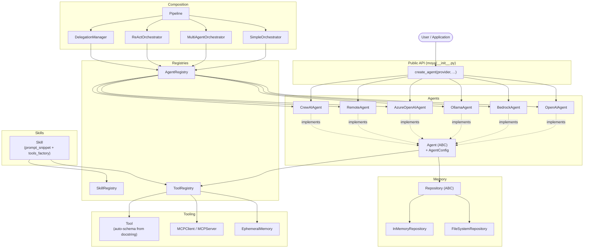

---

## 2. Agent Layer

### Class Hierarchy

Every agent inherits from the abstract `Agent` base class, which enforces a uniform interface regardless of the underlying LLM provider.

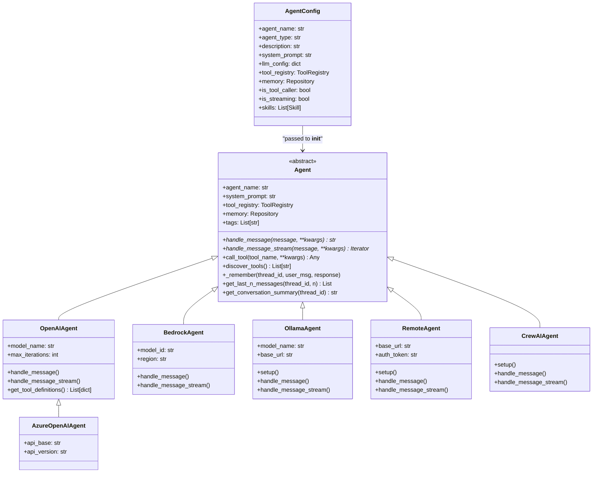

### Skill Attachment at Construction

When an agent is constructed with `skills=[...]`, the base class `__init__` iterates through each skill **before** the subclass finishes initialising:

1. If `skill.prompt_snippet` exists → append it to `config.system_prompt`.
2. If `skill.tools_factory` exists → call it and register each returned `Tool` into `config.tool_registry`.

This means the fully-assembled `system_prompt` (base + all snippets) is ready when the subclass first reads it, and the tool registry is fully populated before the first `handle_message()` call.

---

## 3. Tool Calling Flow

### Tool Definition

Tools are plain Python functions. MOYA auto-generates the JSON schema from type hints and the docstring:

```
get_weather(city: str) -> str
  docstring:
    "Return current weather.
     Parameters:
     - city: The city name."
```

Auto-generates:
```json
{
  "name": "get_weather",
  "description": "Return current weather.",
  "parameters": {
    "city": {"type": "string", "description": "The city name."}
  }
}
```

### Execution Flow

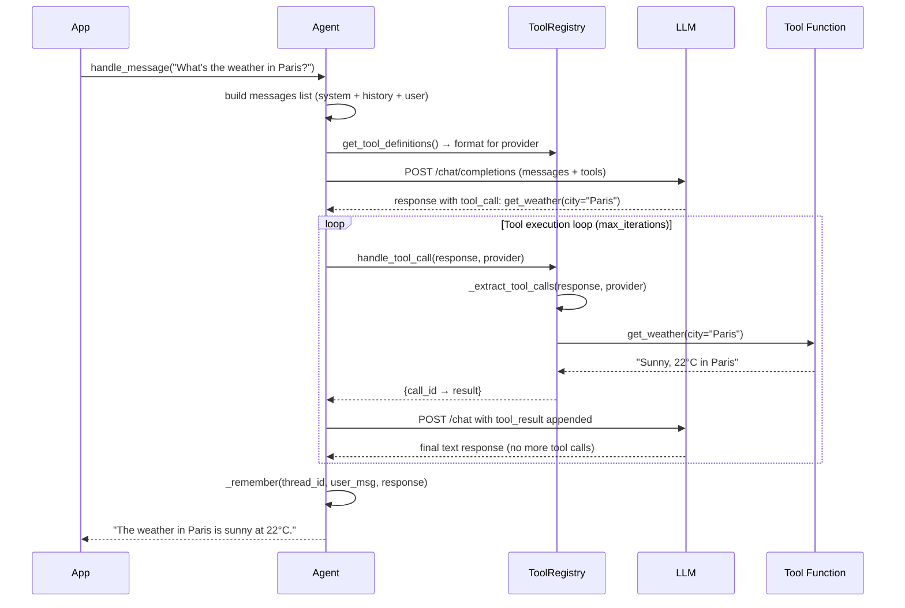

### Provider-Specific Schema Formatting

`ToolRegistry` stores tools in a provider-neutral format. Each agent's `get_tool_definitions()` converts to the provider's wire format:

| Provider | Schema format |
|---|---|
| OpenAI | `{"type": "function", "function": {"name": ..., "parameters": {"type": "object", "properties": {...}}}}` |
| Bedrock (Converse) | `{"toolSpec": {"name": ..., "inputSchema": {"json": {"type": "object", "properties": {...}}}}}` |
| Ollama | Same as OpenAI (Ollama uses OpenAI-compatible tool format) |

`ToolRegistry._extract_tool_calls()` handles the inverse — parsing the LLM's response back into `{id, name, arguments}` triples regardless of provider.

---

## 4. Memory Model

### Conversation Thread Structure

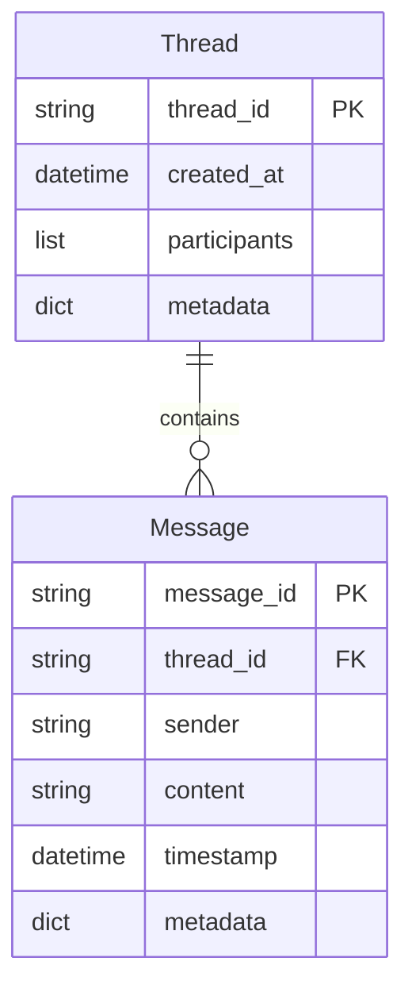

### Repository Pattern

`Repository` is an abstract base class. Swap implementations without changing any agent code:

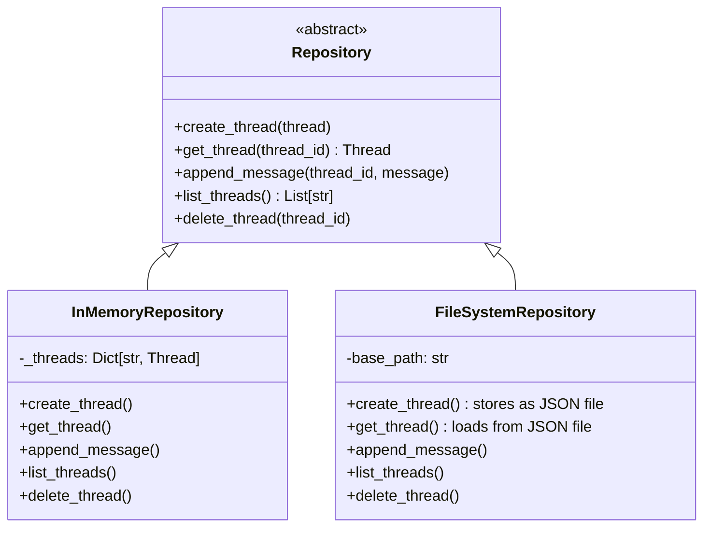

### EphemeralMemory

`EphemeralMemory` is a convenience wrapper that turns memory operations into **tools** the LLM can call directly. Each instance gets its own isolated `InMemoryRepository`:

```python
em = EphemeralMemory()              # private repository
em.configure_memory_tools(registry) # registers store_message, get_last_n_messages,
                                    # get_thread_summary into registry
```

This allows a tool-calling agent to manage its own memory without the calling code tracking thread IDs explicitly.

---

## 5. Pipeline Execution Model

A `Pipeline` is a list of steps that transform a `FlowContext`. The context carries:

- `thread_id` — conversation identity
- `message` — original user message (read-only by convention)
- `output` — mutable string passed between steps
- `metadata` — dict for step-to-step annotations

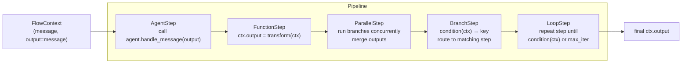

### Step Types in Detail

**`AgentStep`** — passes `ctx.output` to `agent.handle_message()` and replaces `ctx.output` with the response.

**`FunctionStep`** — calls `func(ctx) -> ctx`. Pure Python; use for data transformation, saving to metadata, etc.

**`ParallelStep`** — runs multiple sub-steps concurrently via `ThreadPoolExecutor`. Each branch gets a copy of `ctx`; a merge function combines the outputs.

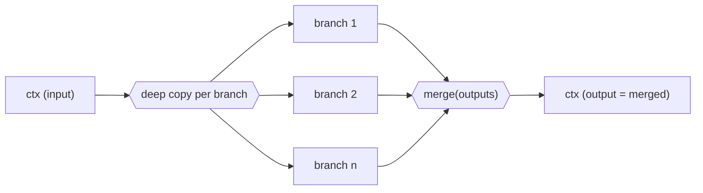

**`BranchStep`** — evaluates `condition(ctx)` to get a key, then runs the step at `branches[key]`. Raises `KeyError` for unknown keys.

**`LoopStep`** — runs the inner step repeatedly. Stops when `until(ctx)` returns `True` or `max_iterations` is reached.

### Nesting Pipelines

Pipelines can be nested inside `FunctionStep` using `pipeline.run_ctx(ctx)`:

```python
inner = Pipeline([AgentStep(writer), FunctionStep(format)])
outer = Pipeline([
    AgentStep(researcher),
    FunctionStep(lambda ctx: inner.run_ctx(ctx)),
])
```

---

## 6. Orchestration Patterns

### Simple Orchestrator

Routes a message to a named agent (from `kwargs["agent_name"]`) or the configured default:

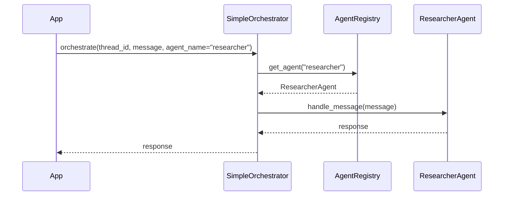

### Multi-Agent Orchestrator

Uses an `LLMClassifier` to select the best agent based on the message content and available agent descriptions:

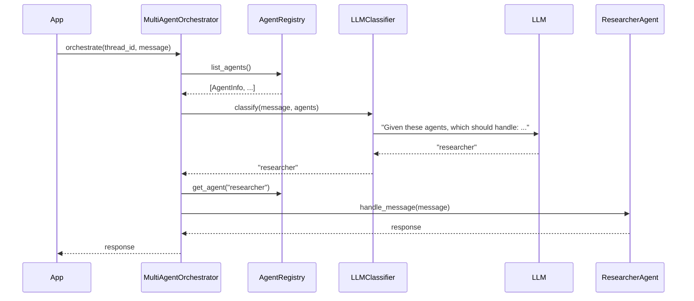

### ReAct Orchestrator

Implements the Thought → Action → Observation loop, letting the LLM reason about which agent to call next:

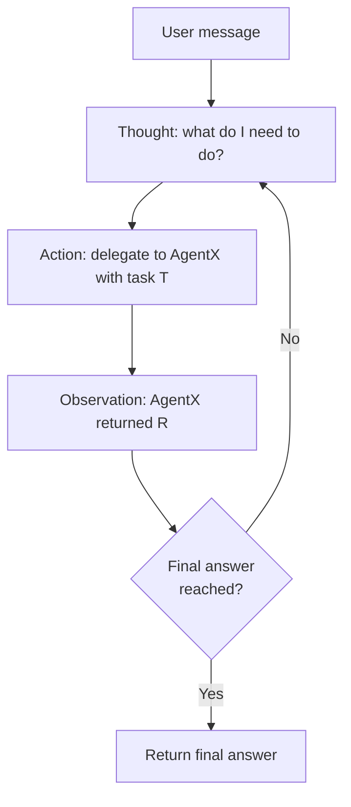

### DelegationManager

Provides programmatic sub-agent delegation with:

- **Depth limiting** — `MaxDelegationDepthError` prevents infinite delegation chains. Depth is tracked per-thread using `threading.local()`.
- **Parallel dispatch** — `delegate_parallel([(task, agent_name), ...])` runs tasks concurrently and returns results in the same order.
- **Tool wiring** — `setup_tools(tool_registry)` registers two callable tools into any agent's registry: `list_agents` (returns available agents) and `delegate_task` (delegates to a named agent).

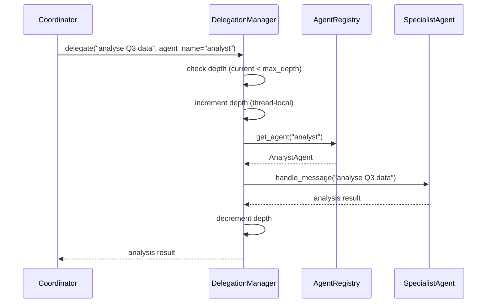

---

## 7. Skills System

A `Skill` bundles two optional additions to an agent:

| Field | Type | Effect |
|---|---|---|
| `prompt_snippet` | `str` | Appended to the agent's `system_prompt` at construction time |
| `tools_factory` | `Callable[[], List[Tool]]` | Called at construction; returned tools are registered in `tool_registry` |
| `tags` | `List[str]` | Used for `SkillRegistry.find_by_tag()` |
| `version` | `str` | Semver string for tracking skill evolution |

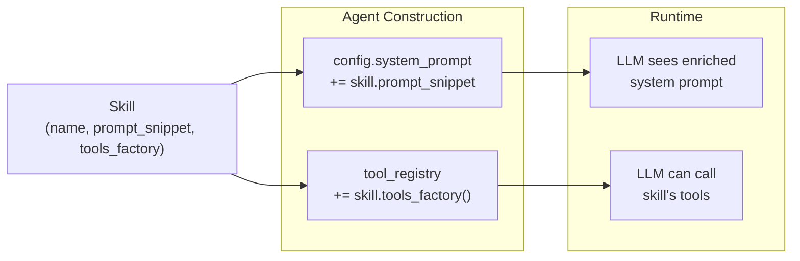

Skills are composable: attach multiple skills to one agent and all snippets are appended in order, all tools are registered.

---

## 8. Registry Subsystem

### AgentRegistry

Central catalogue of live agent objects. Supports multiple discovery methods:

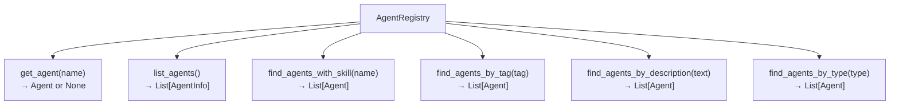

`list_agents()` returns `AgentInfo` snapshots (immutable metadata) rather than live agent references, so callers can inspect available agents without holding strong references.

### SkillRegistry

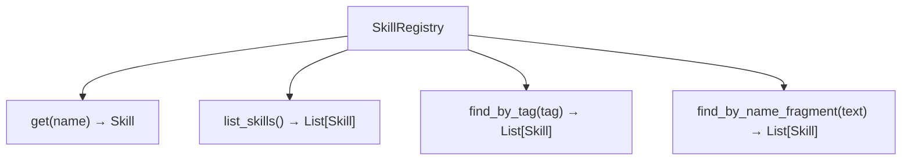

---

## 9. MCP Integration

MOYA implements the [Model Context Protocol](https://modelcontextprotocol.io/) on both sides:

### MCPServer

Wraps a `ToolRegistry` and exposes its tools to any MCP-compliant client. Supports two transports:

- **`stdio`** — run as a subprocess; communication over stdin/stdout (default for local tools).
- **`sse`** — run as an HTTP server for remote tool exposure.

### MCPClient

Connects to an MCP server and makes its tools available as regular `Tool` objects inside a `ToolRegistry`.

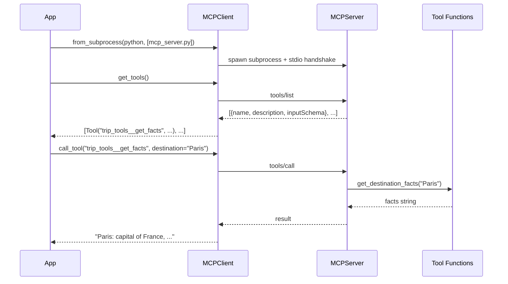

**Naming convention**: MCP tools are exposed with a `__` separator between server name and tool name (e.g. `trip_tools__get_destination_facts`) because `/` is not valid in OpenAI function names.

The `MCPClient` runs its async event loop in a background daemon thread and exposes a synchronous API, so it integrates seamlessly into synchronous agent code.

---

## 10. Data Flow: End-to-End Request

Putting it all together: a user message through a Multi-Agent Orchestrator with tool-calling agents and persistent memory.

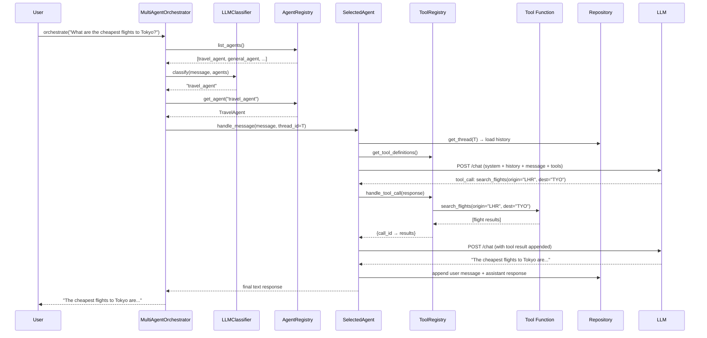

---

## 11. Design Principles

**Provider-agnostic at every layer.** Tools, memory, skills, and the agent interface are all defined without reference to any LLM provider. Provider-specific concerns (schema format, streaming protocol, credential chain) are confined to each agent class.

**Composition over inheritance.** The framework favours small, focused objects assembled at runtime — agents gain capabilities through skills and tool registries, not subclassing. Pipelines compose steps; orchestrators compose agents.

**No global mutable state.** Every registry, repository, and memory object is explicitly constructed and passed. There are no module-level singletons that would cause test pollution or ordering effects.

**Lazy network I/O.** Agent constructors perform no network calls. Ollama calls its health check in `setup()`, which is deferred to first use. Bedrock imports boto3 lazily inside `__init__()` with a helpful error if not installed.

**Uniform streaming contract.** `handle_message_stream()` on every agent is a generator that yields `str` chunks. Callers can always `"".join(agent.handle_message_stream(...))` to get the full response, or stream tokens as they arrive.
